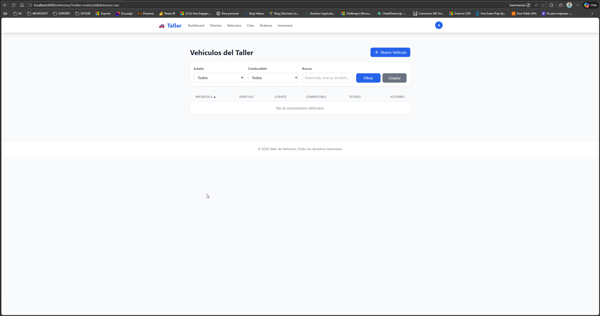

# 🧪 Cómo Probar la FASE 0

Guía rápida para probar que todo funciona correctamente.

---

## 🚀 Método 1: Script Automático (RECOMENDADO)

### En Windows:

1. **Abrir terminal** en la carpeta `TallerVehiculos`
2. **Ejecutar el script de prueba**:
   ```cmd
   test_fase0.bat
   ```

Este script verificará automáticamente:
- ✅ Python instalado
- ✅ Django instalado
- ✅ Todas las dependencias
- ✅ Configuración correcta
- ✅ Migraciones aplicadas
- ✅ Estructura de archivos
- ✅ Todas las aplicaciones creadas

### En Linux/Mac:

```bash
chmod +x test_fase0.sh
./test_fase0.sh
```

---

## 🎯 Método 2: Iniciar el Servidor

### Opción A: Usando el script run.bat (Windows)

1. **Doble clic** en `run.bat`

   O desde la terminal:
   ```cmd
   cd TallerVehiculos
   run.bat
   ```

2. **Espera** a que se inicie el servidor

3. **Abre tu navegador** y visita:
   - 🏠 **Aplicación**: http://localhost:8000
   - 👨‍💼 **Admin**: http://localhost:8000/admin
   - 📊 **Dashboard**: http://localhost:8000/dashboard

### Opción B: Usando el script run.sh (Linux/Mac/Git Bash)

```bash
cd TallerVehiculos
./run.sh
```

### Opción C: Manualmente

```bash
cd TallerVehiculos

# Activar entorno virtual
source .venv/Scripts/activate  # Git Bash en Windows
# o
.venv\Scripts\activate         # CMD en Windows
# o
source .venv/bin/activate      # Linux/Mac

# Ejecutar servidor
python manage.py runserver
```

---

## 🔑 Credenciales de Acceso

Usa estas credenciales para acceder al admin:

- **Usuario**: `admin`
- **Contraseña**: `admin123`

---

## ✅ Checklist de Pruebas

Verifica que puedas hacer lo siguiente:

### 1. Página Principal (http://localhost:8000)
- [ ] La página carga sin errores
- [ ] Redirige al login (porque requiere autenticación)

### 2. Admin Panel (http://localhost:8000/admin)
- [ ] Aparece el formulario de login
- [ ] Puedes iniciar sesión con `admin`/`admin123`
- [ ] Ves el panel de administración de Django
- [ ] Aparecen las secciones: Users, Groups

### 3. Dashboard (http://localhost:8000/dashboard)
- [ ] Requiere login (redirige a /accounts/login/)
- [ ] Después de login, muestra el dashboard
- [ ] Se ven las 4 tarjetas de estadísticas:
  - Total Clientes: 0
  - Citas Hoy: 0
  - Órdenes Activas: 0
  - Facturación del Mes: €0
- [ ] La navegación superior funciona
- [ ] El menú de usuario (esquina superior derecha) funciona
- [ ] El menú responsive (móvil) funciona

### 4. Frontend
- [ ] **Tailwind CSS**: Los estilos se ven correctamente (colores, espaciado, etc.)
- [ ] **Alpine.js**: El menú de usuario se abre/cierra al hacer click
- [ ] **Responsive**: En pantalla pequeña aparece el menú hamburguesa
- [ ] **Mensaje de bienvenida**: Aparece "¡Proyecto Configurado Exitosamente!"

### 5. Funcionalidad
- [ ] Logout funciona (botón "Cerrar Sesión")
- [ ] Redirige correctamente al login después de logout
- [ ] Login funciona correctamente

---

## 🐛 Solución de Problemas

### Error: "No module named 'django'"
```bash
cd TallerVehiculos
source .venv/Scripts/activate
pip install -r requirements/base.txt
```

### Error: "ModuleNotFoundError: No module named 'apps.core'"
Verifica que el archivo `apps/core/apps.py` tenga:
```python
name = 'apps.core'
```

### Error: "That port is already in use"
El puerto 8000 está ocupado. Usa otro puerto:
```bash
python manage.py runserver 8001
```

### El servidor no inicia
1. Verifica que estás en la carpeta correcta: `TallerVehiculos`
2. Verifica que el entorno virtual esté activado
3. Ejecuta: `python manage.py check`

---

## 📸 Capturas de Pantalla Esperadas

### Dashboard
Deberías ver:
- Barra de navegación superior con logo "🚗 Taller"
- Menú con: Dashboard, Clientes, Vehículos, Citas, Órdenes, Inventario
- 4 tarjetas con estadísticas (todas en 0)
- Tarjeta de bienvenida "¡Proyecto Configurado Exitosamente!"
- Checkmarks verdes: Django 6.0 ✓, HTMX ✓, Alpine.js ✓, Tailwind CSS ✓

### Admin Panel
Deberías ver:
- Interfaz de administración de Django
- Logo "Django administration"
- Secciones: Authentication and Authorization

---

## 🎉 Todo Funciona

Si todas las pruebas pasan, ¡la FASE 0 está completamente funcional!

Estás listo para continuar con:
- **FASE 1**: Autenticación y Usuarios

---

## 📞 Comandos Útiles

```bash
# Ver versión de Django
python -c "import django; print(django.get_version())"

# Verificar configuración
python manage.py check

# Ver migraciones
python manage.py showmigrations

# Crear superusuario adicional
python manage.py createsuperuser

# Abrir shell de Django
python manage.py shell

# Ver todas las URLs disponibles
python manage.py show_urls
```

---

**Documento creado**: 2026-03-05
**Fase**: 0 - Configuración Inicial
